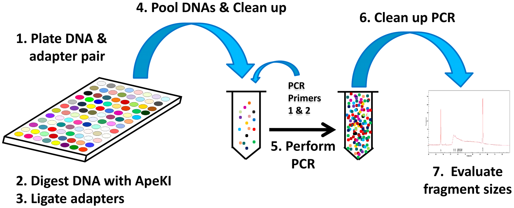
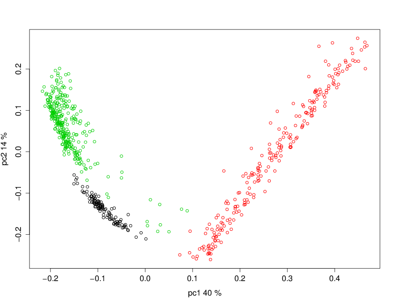
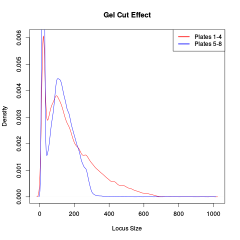
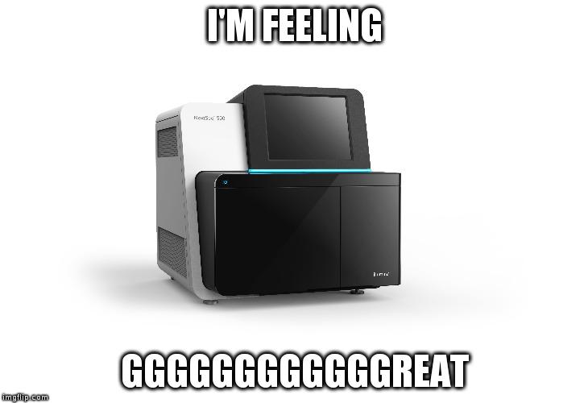
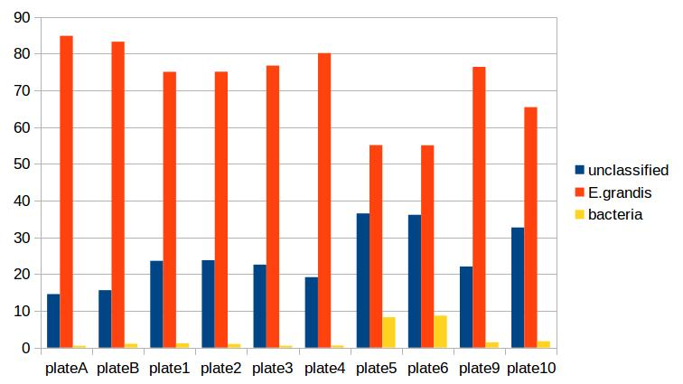

=================================
Genotyping By Sequencing Analysis
=================================

Introduction
============

GBS is a fast, cheap and relatively easy way of assaying genetic variation in a
very high throughput manner. This workshop will show attendees
the way we analyse GBS data in the Borevitz lab.

I'll go over both the theory of GBS and how we analyse it.

.. note::
   The demonstration dataset mentioned here was available online but has been
   removed. Suitable datasets are available from the author.

.. contents::

Who am I?
---------

::

    Kevin Murray
    PhD Student,
    Borevitz Lab,
    ARC Centre of Excellence in Plant Energy Biology,
    ANU,
    Canberra, Australia.

Feel free to contact me at kevin.murray@anu.edu.au about any part of this
workshop. There is also my `github <https://github.com/kdmurray91>`_ and
`personal website <https://kdmurray.id.au/>`_.

    I live here in Canberra. Not a bad place to be.

VM Setup
--------

Go ahead and start setting up the AWS instance. We need an

  - Ubuntu 14.04 HVM 64 bit
  - m3.2xlarge instance size

To setup the virtual machine, we will use Ansible. SSH into your VM and run:

.. code-block:: shell

    sudo apt-get update && \
        sudo apt-get -yy upgrade && \
        sudo apt-get -yy install ansible

    wget https://s3-us-west-1.amazonaws.com/emel1234/ansible.tar
    tar xvf ansible.tar
    ansible-playbook -i ansible/hosts ansible/playbook.yml

In many cases below, I'll use ``gbsvm`` as the remote server name. Please add
the following to your ``~/.ssh/config`` to use this verbatim, or work out what
the ugly long command is. ::

    Host gbsvm
        HostName <YOUR PUBLIC IP>
        IdentityFile <YOUR .pem or ~/.ssh/id_rsa>
        IdentitiesOnly yes
        User ubuntu

What is GBS?
============

GBS is a reduced-representation sequencing library preparation method. The
general idea is to assay a small, reproducible subset of the genomes of all
samples. This is achieved using a restriction enzyme digest followed by a
PCR-based Illumina library preparation protocol. Elshire et al. proposed the
method and their paper explains the protocol in detail [ElshireGBS]_. The
important points of the protocol are reproduced below.

GBS wet lab overview
--------------------

DNA is extracted as usual, and digested with a restriction enzyme (in our case,
PstI). Sticky-ended adaptors are ligated to digested fragments, and amplified
using PCR. This also roughly size-selects for inserts between about 50 and 500
bp. A gel- or bead-based clean up is used to refine this size selection.
Individual libraries are quantified and pooled equimolar into a single pooled
library that is sequenced in one Illumina lane (we use a HiSeq 2500, and have
had issues with the two-dye chemistry). For a more detail description of the
protocol, please see the paper describing the protocol [ElshireGBS]_.

   The molecular protocol of GBS, directly from [ElshireGBS]_.

An important and common modification to the original protocol is the use of
combinatorial adaptors. This involves using modified adaptors such that the
forward and reverse reads contain independent short nucleotide sequences that
identify the sample. The Borevitz lab (and others) use barcodes of differing
length, which avoids nucleotide imbalance that would occur if all reads
contained the restriction site at the same position. Nucleotide imbalance
causes the Illumina base-calling algorithms to fail.

GBS data overview
-----------------

The most common form of GBS data you are likely to receive is a raw FASTQ file.
This FASTQ file will contain all reads from all samples that were sequenced in
an Illumina lane. You will also need some form of metadata table associating at
least each sample's DNA barcode with sample name or ID, and likely also
population and collection metadata where applicable. Various tools have
different format requirements for this metadata, so some interconversion may be
required (when is it not in bioinformatics!).

Forgive the banality, but I should take this opportunity to emphasise the
importance of backups, replication and versioning of both sequencing data *and*
associated metadata. We've lost many thousands of dollars worth of GBS
experiment due to failures in hardware, software or user.

Analysis of GBS data
====================

Workflow overview
-----------------

- Assess dataset quality with FastQC [#fqc]_
- Demultiplex reads with Axe [#axe]_
- QC reads with gbsqc [#gqc]_
- Detect loci and call variants *de novo* using Stacks [#stk]_

Data
----

Our data is derived from a sequencing experiment in *Eucalyptus melliodora*
(Yellow Box Gum), a key species in the Box Gum Grassy Woodland ecosystem that
surrounds Canberra. This ecosystem is endangered due to agricultural
deforestation throughout Australia's eastern seaboard, so several landscape
genomic projects are ongoing. Key to these projects is the determination of
genetic relatedness between many hundred samples taken from remnant stands of
*E. melliodora*.

  *Eucalyptus meliodora* mature tree. From wikimedia commons, CC BY 3.0. See
  https://commons.wikimedia.org/wiki/File:Eucalyptus_melliodora_1.jpg

Obtaining the dataset
^^^^^^^^^^^^^^^^^^^^^

The data is available as a tarball at:

    https://s3-us-west-1.amazonaws.com/emel1234/kdm-gbs.tar

You can download this using:

.. code-block:: shell

    sudo chown ubuntu /mnt
    cd /mnt

    wget https://s3-us-west-1.amazonaws.com/emel1234/kdm-gbs.tar
    wget https://s3-us-west-1.amazonaws.com/emel1234/kdm-gbs.tar.sha
    sha512sum -c kdm-gbs.tar.sha

    tar xvf kdm-gbs.tar

    rm -f kdm-gbs.tar*

You have been given several data files:

- ``Emel-lb1234_R1.fastq.gz`` and ``Emel-lb1234_R2.fastq.gz``: Raw read files
  (forward and reverse)
- ``Emel-lb1234.axe``: The Axe keyfile, a mapping of DNA barcodes to sample
  names.

Metadata
--------

The information which any sequencing experiment generates is useless without
well curated metadata. This sounds self-evident, however in our experience most
issues that arise during the analysis of GBS data are caused but incorrect or
missing metadata. The sample names associated with our sample barcodes have
been pre-curated and are in the file ``Emel-lb1234.axe``.

Quality Control
---------------

As is customary for all NGS analyses, the first step in the analysis of GBS
data is to check the technical quality of the reads we have obtained. This is
done with FastQC[#fqc]_:

.. code-block:: shell

  mkdir -p fastqc
  fastqc --extract -o fastqc reads/Emel-lb1234_R[12].fastq.gz

  # Copy the fastqc output home
  scp -r gbsvm:/mnt/fastqc ./

Inspect the FastQC HTML output (files under ``./fastqc/``).

Demulitplexing
--------------

You may remember our samples come in one big FASTQ file. This is not what we
want, so we need to demultiplex the reads such that the samples are each in
their own file. We do this before quality trimming, so that reads are not
manipulated before being demultiplexed (as barcode sequences often have quite
low quality scores).

Demultiplexing is performed using Axe, as few other demultiplexers can handle
the rather eclectic needs that GBS has. Barcodes differ in length, and are
applied combinatorially (different of R1 and R2). The following incantation
should to the trick:

.. code-block:: shell

  mkdir -p demuxed
  axe-demux                                 \
        -c                                  \
        -b Emel-lb1234.axe                  \
        -t Emel-lb1234.stats                \
        -f reads/Emel-lb1234_R1.fastq.gz    \
        -r reads/Emel-lb1234_R2.fastq.gz    \
        -I demuxed/

Axe will have demultiplexed reads into individual interleaved files, under the
directory ``./demuxed``. Sample-wise read counts have been saved to the
``Emel-lb1234.stats`` file.  The following R snippet can be used to generate a
histogram of read counts across all samples. You can run it on the command
line, or locally after downloading the stats file if you want to play around
with other plots or stats.

.. code-block:: shell

    cat <<EOF >plot_read_nums.R
    axe <- read.delim("Emel-lb1234.stats", stringsAsFactors=F)
    # Remove count of reads without barcodes
    axe <- axe[axe$Sample != "No Barcode",]
    pdf("read-hist.pdf")
    hist(axe\$Count, breaks=50)
    dev.off()
    EOF

    Rscript plot_read_nums.R

    # Copy the plot output home
    scp -r gbsvm:/mnt/read-hist.pdf ./

Quality and Adaptor Trimming
----------------------------

We need to remove both adaptor read-through and low-quality sections from our
reads. Additionally, due to the rather inane requirement of Stacks that all
reads be the same length, we need to enforce the truncation of long reads, and
remove shorter reads. We use a tool of our own named gbsqc, but Trimmomatic and
other similar tools will work just as well (albeit with more duct-tape). As we
have many files now, we need to loop over each of them. Since we have multiple
cores to use, we can utilise GNU parallel instead of a simple for loop [#]_.

.. code-block:: shell

  cut -f 3 < Emel-lb1234.axe | grep -v '^#' >Emel-lb1234.samples
  mkdir -p qcd reports
  cat Emel-lb1234.samples | parallel -j 4 --verbose \
    gbsqc -q 25                                     \
          -l 64                                     \
          -y reports/{}.yml                         \
          -y reports/{}.yml                         \
          demuxed/{}_il.fastq                       \
      \| gzip \> qcd/{}-qc_il.fastq.gz

So now we have a directory containing a FASTQ file for each sample. In theory,
no contaminants are present in the reads.

.. [#] In case you've never seen GNU parallel before, I urge you to look it up
   and become familiar with its use. It sure comes in handy.

Variant calling
---------------

Stacks is used to assemble loci and call variants in a *de novo* fashion
[CatchenStacks]_.  Stacks works by clustering reads into loci (or stacks), then
detecting variation between these stacks. Reads are condensed to unique (or
near-unique) stacks with ``ustacks``. A pan-population catalog of stacks is made
with ``cstacs``, and this is used to call variants across samples.

.. code-block:: shell

    # This is a hack to prepare a list of -s samp1.fq -s samp2.fq ...
    # but only for samples with enough reads, as there are some failed
    # samples # and stacks will fail if there are samples with no or too
    # few reads.
    samples=$(find qcd/ -type f -size +100k | xargs -l1 echo "-s")

    mkdir -p stacks_output

    denovo_map.pl                                   \
        -T 4                                        \
        -t                                          \
        -S                                          \
        -b 1                                        \
        -n 2                                        \
        -o stacks_output                            \
        $samples

This command will create a population file, an internal data format that stacks
uses to represent its state. To produce a VCF file for further analysis, we use
the `populations` command from `stacks`.

.. code-block:: shell

    populations                                     \
        -t 4                                        \
        -r 0.01                                     \
        -b 1                                        \
        -P stacks_output                            \
        -e pstI                                     \
        --write_single_snp                          \
        --vcf                                       \
        --fstats

Next Steps
==========

Yes, I'm stopping half way through. This is deliberate. Once you have the
output of the stacks pipeline, what you do is highly dependent on:

 - Your dataset
 - Your question(s)
 - Your advisor's biases
 - Your own biases
 - What you ate for breakfast last Wednesday

However, I will briefly mention what we do.

Data filtering
--------------

We filter the SNP matrix by removing:

    - Loci with too few variant calls (Non-missing sample calls)
    - Loci with too few reads
    - Loci with too many heterozygous calls
    - Samples with too few loci called

This is too often done by eye, using custom R scripts. Please don't judge us!
We sometimes do reproducible science too!

PCA
---

Within a (putative or actual) species, dendrograms or trees are not always
a valid representation of the data. This is especially true in plant species,
or any species with a lot of admixture or gene flow. So we nearly always use
PCA to examine the relationships between samples. We often also plot PCA axes
in 3D, using ``Rgl``.

.. figure:: imgs/emel-pcoa.png
    :alt: PCA

    This is a PCoA of the eucalptus samples we have been analysing. This PCoA
    shows the subtle isolation by distance that exists in the *Eucalypus
    meliodora* populations we have analysed. The colours represent latitudinal
    regions between Melbourne and Brisbane.

Pitfalls of GBS
===============

No protocol or method produces perfect data, and GBS certainly produces it's
share of imperfections. Throughout this section, keep in mind that GBS is not
designed as an absolute method able to definitively determine relatedness.
Rather **GBS is a cheap, reliable estimate of relatedness**. For many, if not
most, applications in population genetics, this is more than sufficient.

Technical batch effects
-----------------------

One artifact we sometimes see is artifacts of the library preparation protocol.
In particular, we have seen cases where there is a strong lane effect on
genetic signal. The following PCA is coloured by lane. These three lanes
contain mostly mother trees (green) and mostly daughters (black and red).

   A strong lane effect. Plot prepared by Megan Supple.

This was traced to inconsistent size selection, as is shown in the following
density plot.

   This plot shows that two lanes differ in their size selection. Lane 5-8 was
   size selected more strictly than lane 1-4, as shown by the absence of loci
   over 300bp.

Another source of these batch effects can be sequencing platform. We have seen
cases where replicates failed to cluster as one lane was sequenced on a HiSeq
2500 and one on a NextSeq.

    Who thought that adding all these Gs would be a good idea.

Input sample quality
--------------------

Input DNA quality can have a significant effect on the quality of results.
Partially degraded DNA will form libraries of poor quality or low complexity,
and can lead to systematic effects if sample quality is confounded with
biologically significant variables (which it often is).

Sample heterogeneity
--------------------

Frequently the concentration of DNA in individual libraries is too low to
reliably quantitiate. This can lead to quite variable coverage between samples,
that in turn can cause inaccuracies in the calculation of relatedness. The best
course of action in such a situation is simply to drop samples with too few
reads. The exact definition of "too few" is debatable, but we frequently use
500,000 reads as a hard cut off, and sometimes raise this to 1 million. Any
other choice is probably equally valid and equally arbitrary.

It is worth bearing this advice in mind as early as possible in the planning of
GBS experiments. GBS is a high throughput method, and samples fail at greater
frequency than other methods. If you have samples that are particularly
important, please consider sequencing them in at least duplicate. This is
especially true if your important samples are of lower quality (which they
often are).

Contamination
-------------

As is the case for most *de novo* algorithms, there is an implicit assumption
that all reads come from the same individual. However biology can sometimes get
in the road of this reasonable assumption, particularly in plant species with
endo- or exophytic microorgansims. We have seen cases where up to 20% of reads
and a similar percentage of assembled loci come from fungal or bacterial
endosymbionts of *Eucalyptus*. This is not limited to plant species, there are
many organisms with similar microorgansimal communities.

If your samples are know or suspected to contain genetic material from other
species, it may be worth using taxonomic read classification tools such as
Kraken [#kra]_ to partition reads into target and non-target species after QC,
and proceed with loci assembly and variant calling only with target species
reads.  An alternative is to use BLAST or similar tools to taxonomically
classify the assembled loci, and exclude any non-target species' loci from the
VCF file before any post-analysis.

References
==========

Papers
------

.. [ElshireGBS]  Elshire RJ et al. (2011) **A Robust, Simple
    Genotyping-by-Sequencing (GBS) Approach for High Diversity Species.** *PLoS
    ONE* doi:`10.1371/journal.pone.0019379
    <https://dx.doi.org/10.1371/journal.pone.0019379>`_
.. [CatchenStacks] Catchen, J. M., Amores, A., Hohenlohe, P., Cresko, W., &
    Postlethwait, J. H. (2011). **Stacks: Building and Genotyping Loci De Novo
    From Short-Read Sequences.** *G3: Genes, Genomes, Genetics*, 1(3), 171–182.
    doi:`10.1534/g3.111.000240 <http://doi.org/10.1534/g3.111.000240>`_:w

Tools
-----

.. [#fqc] FastQC: http://www.bioinformatics.babraham.ac.uk/projects/fastqc/
.. [#axe] Axe: https://github.com/kdmurray91/axe
.. [#gqc] gbsqc: https://github.com/kdmurray91/libqcpp
.. [#stk] Stacks: http://catchenlab.life.illinois.edu/stacks/
.. [#par] parallel: https://www.gnu.org/software/parallel/
.. [#kra] Kraken: http://ccb.jhu.edu/software/kraken/MANUAL.html
